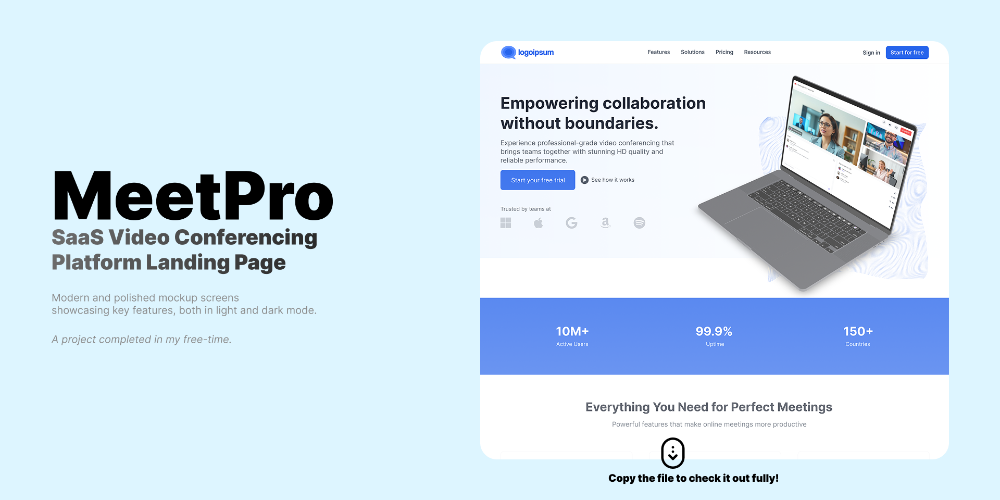

# VizorLite



A modern, real-time video conferencing application built with React and Node.js, featuring WebRTC technology for high-quality video calls, screen sharing, and real-time collaboration.

## 🚀 Features

- **Real-time Video Calls**: High-quality video conferencing with WebRTC technology
- **Screen Sharing**: Share your screen with other participants in the room
- **User Authentication**: Secure login and registration system
- **Multi-room Support**: Create and join multiple video rooms
- **Real-time Communication**: Instant messaging and notifications
- **Responsive Design**: Works seamlessly across devices (desktop, tablet, mobile)

## 🛠️ Technology Stack

### Frontend
- **React**: JavaScript library for building user interfaces
- **TypeScript**: Type-safe JavaScript development
- **React Router**: Client-side routing and navigation
- **Socket.io-client**: Real-time bidirectional event-based communication
- **Simple-peer**: WebRTC wrapper for peer-to-peer connections
- **Axios**: Promise-based HTTP client

### Backend
- **Node.js**: JavaScript runtime environment
- **Express.js**: Web application framework
- **MongoDB**: NoSQL database for user and room data
- **Mongoose**: MongoDB object modeling for Node.js
- **Socket.io**: Real-time WebSocket communication
- **JSON Web Token (JWT)**: Secure authentication
- **Bcrypt**: Password hashing library
- **Express-validator**: Input validation and sanitization
- **CORS**: Cross-origin resource sharing

## 📋 Prerequisites

Before you begin, ensure you have the following installed:
- Node.js (v14 or higher)
- npm or yarn package manager
- MongoDB (either local installation or cloud service like MongoDB Atlas)

## 🚀 Installation

### Backend Setup

1. Navigate to the backend directory:
   ```bash
   cd backend
   ```

2. Install dependencies:
   ```bash
   npm install
   ```

3. Create a `.env` file in the backend root directory with the following variables:
   ```env
   PORT=5000
   MONGODB_URI=your_mongodb_connection_string
   JWT_SECRET=your_jwt_secret_key
   FRONTEND_URL=http://localhost:3000
   ```

4. Start the backend server:
   ```bash
   npm run dev  # for development
   # or
   npm start    # for production
   ```

### Frontend Setup

1. Navigate to the frontend directory:
   ```bash
   cd frontend
   ```

2. Install dependencies:
   ```bash
   npm install
   ```

3. Create a `.env` file in the frontend root directory with the following variables (if needed):
   ```env
   REACT_APP_API_URL=http://localhost:5000
   ```

4. Start the frontend development server:
   ```bash
   npm start
   ```

## 🎯 Usage

1. Register an account or log in if you already have one
2. Navigate to the dashboard to view available rooms or create a new one
3. Share the room link with others to invite them to the video call
4. Join a room to start the video conference
5. Use the screen sharing feature to share your screen with other participants

## 🏗️ Project Structure

```
VizorLite/
├── backend/              # Node.js/Express server
│   ├── models/           # Database models
│   ├── routes/           # API routes
│   ├── middleware/       # Authentication and other middleware
│   └── server.js         # Main server file
├── frontend/             # React application
│   ├── public/           # Static assets
│   ├── src/
│   │   ├── components/   # React components
│   │   ├── views/        # Page components
│   │   ├── context/      # React context providers
│   │   ├── utils/        # Utility functions
│   │   └── App.tsx       # Main application component
│   └── package.json      # Frontend dependencies
└── README.md             # This file
```

## 🤝 Contributing

Contributions are welcome! Here's how you can contribute to the project:

1. Fork the repository
2. Create a new branch (`git checkout -b feature/AmazingFeature`)
3. Make your changes
4. Commit your changes (`git commit -m 'Add some AmazingFeature'`)
5. Push to the branch (`git push origin feature/AmazingFeature`)
6. Open a Pull Request

## 🐛 Issues

If you encounter any issues or bugs, please open an issue on the GitHub repository with detailed information about the problem.

## 🔐 Environment Variables

Make sure to set up these environment variables in the backend `.env` file:

- `MONGODB_URI`: Your MongoDB connection string (e.g., mongodb://localhost:27017/vizorlite)
- `JWT_SECRET`: Secret key for JWT token signing
- `PORT`: Port number for the backend server (default: 5000)
- `FRONTEND_URL`: URL of your frontend application (default: http://localhost:3000)

## 📄 License

This project is licensed under the ISC License - see the [LICENSE](LICENSE) file for details.

## 📞 Support

For support, please open an issue in the GitHub repository.

---

Made with ❤️ using React, Node.js, and WebRTC technology.